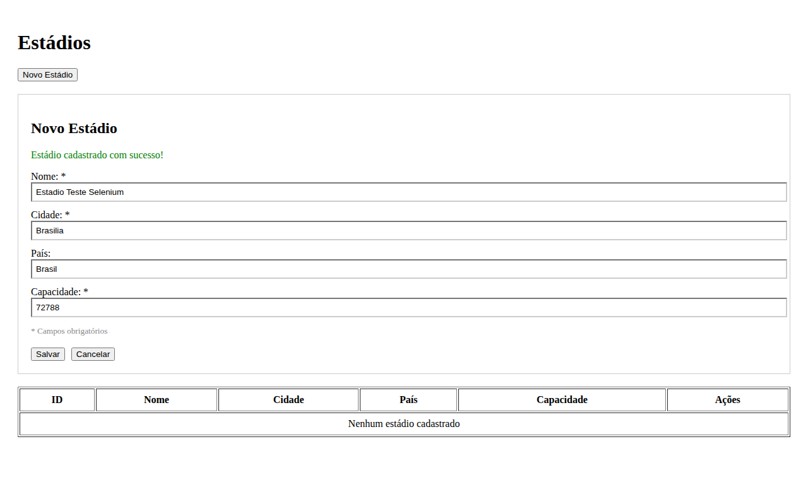
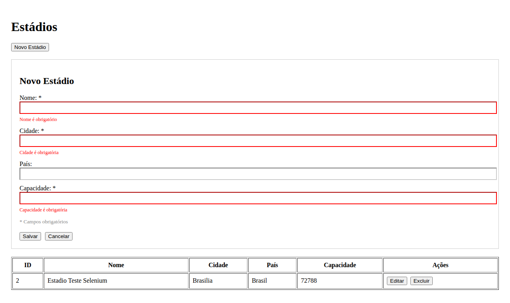
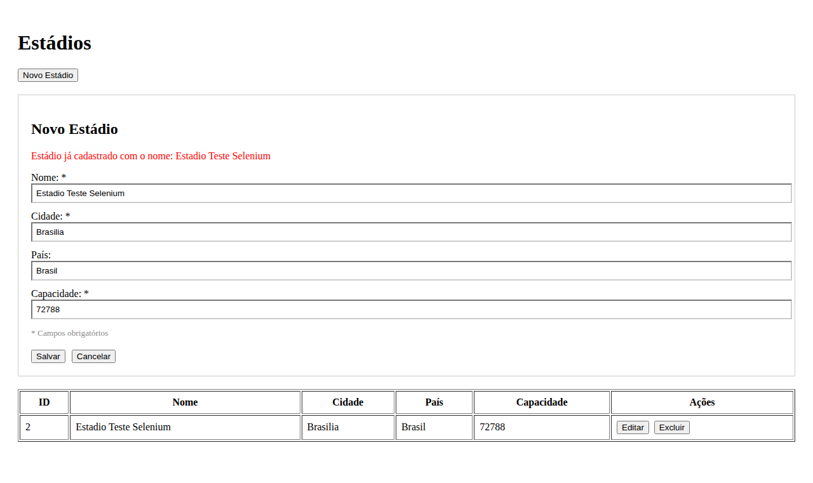
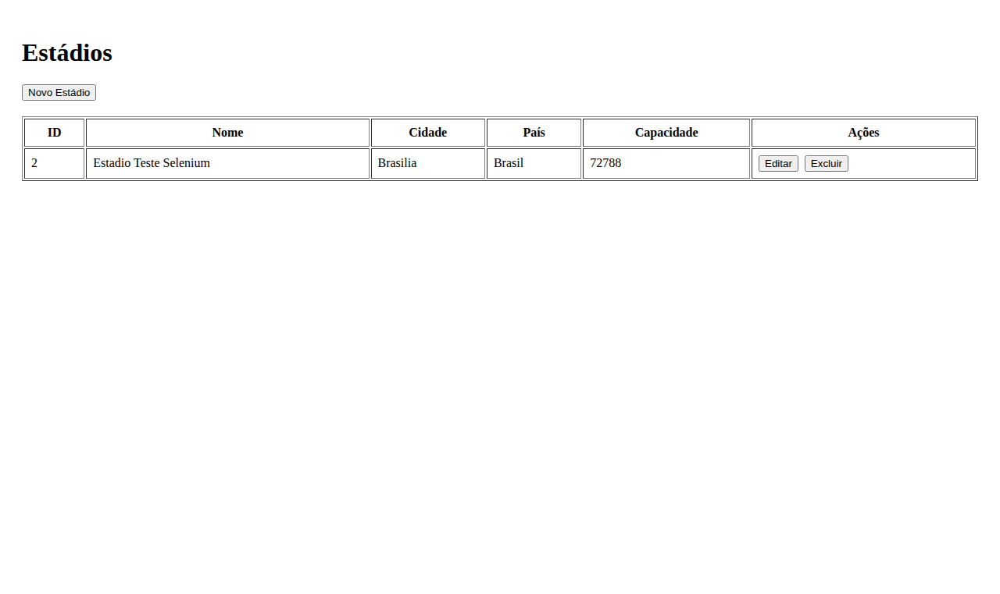
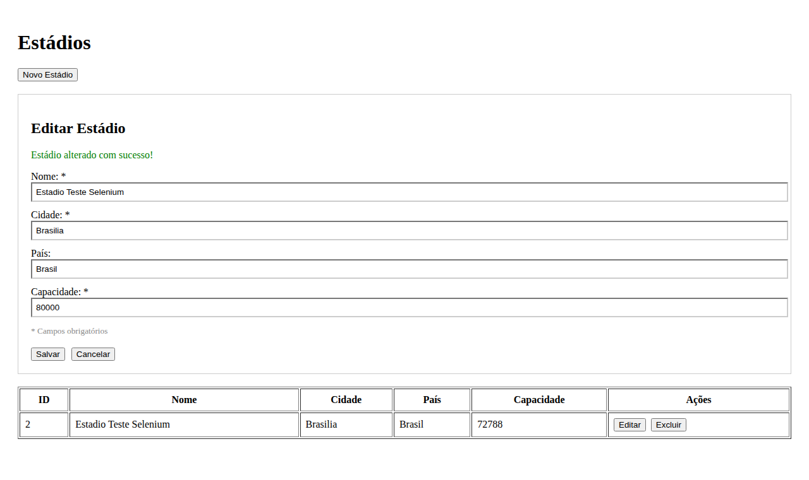
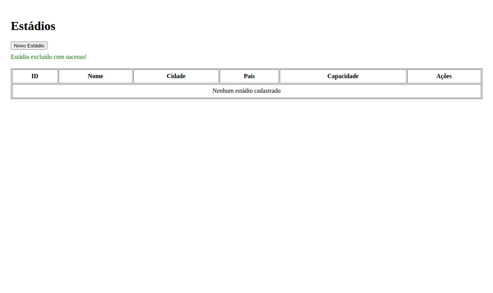

# Casos de Teste de Validação — CRUD de Estádio

Casos de teste funcionais (caixa preta) elaborados a partir do fluxo principal e
alternativo dos casos de uso RF004–RF007 do
[Documento de Requisitos](../docs/documento_requisitos/Documento%20de%20Requisitos%20-%20PitScore.docx).

Execução automatizada com os scripts Selenium em [`selenium/test_casos_validacao.py`](selenium/test_casos_validacao.py)
(ver [#32](../README.md)). Ambiente: backend Spring Boot + PostgreSQL e frontend React
rodando localmente, navegador Chrome (headless). Os print screens em
[`screenshots/`](screenshots/) são capturas reais da execução, e o resultado
(`Aprovado`/`Reprovado`) é o retorno verificado pelo próprio script na interface,
não uma classificação manual.

> O caso de uso RF004 prevê o ator "Administrador" autenticado como
> pré-condição. Como a autenticação ainda não foi implementada nesta etapa do
> projeto, os testes abaixo foram executados sem login.

| Caso de Teste | Funcionalidade | Cenário | Pré-Condições | Dados de Entrada | Resultado Esperado | Print Screen | Status | Local | Observações |
|---|---|---|---|---|---|---|---|---|---|
| CT-001 | Cadastrar Estádio | Cadastro de um novo estádio com todos os dados válidos | 1. Usuário acessa a tela "Estádios" (`/`) 2. Clica em "Novo Estádio" 3. Não existe estádio com o nome usado no teste | Nome=`Estadio Teste Selenium` Cidade=`Brasilia` País=`Brasil` Capacidade=`72788` | Sistema exibe "Estádio cadastrado com sucesso!" e o estádio passa a constar na listagem |  | Aprovado | Tela Estádios → formulário Novo Estádio | Fluxo principal do RF004 |
| CT-002 | Cadastrar Estádio | Tentativa de cadastro sem preencher os campos obrigatórios | 1. Usuário acessa "Estádios" 2. Clica em "Novo Estádio" 3. Clica em "Salvar" sem preencher nenhum campo | Nome=`""`, Cidade=`""`, País=`""`, Capacidade=`""` | Sistema não envia a requisição e exibe "Nome é obrigatório", "Cidade é obrigatória" e "Capacidade é obrigatória" |  | Aprovado | Tela Estádios → formulário Novo Estádio | Fluxo alternativo — validação de formulário (client-side) |
| CT-003 | Cadastrar Estádio | Tentativa de cadastro com nome de estádio já existente | 1. Estádio `Estadio Teste Selenium` já cadastrado (CT-001) 2. Usuário clica em "Novo Estádio" novamente | Nome=`Estadio Teste Selenium` Cidade=`Brasilia` País=`Brasil` Capacidade=`72788` | Sistema exibe a mensagem de erro "Estádio já cadastrado com o nome: Estadio Teste Selenium" e não duplica o registro |  | Aprovado | Tela Estádios → formulário Novo Estádio | Fluxo alternativo do RF004 (2a) — regra de negócio "nome único", validada no backend |
| CT-004 | Consultar Estádio | Consulta da listagem para confirmar a persistência do cadastro | Estádio `Estadio Teste Selenium` cadastrado (CT-001) | Nenhum (apenas navegação até a tela "Estádios") | A tabela exibe uma linha com Nome `Estadio Teste Selenium`, Cidade `Brasilia`, País `Brasil` e Capacidade `72788` |  | Aprovado | Tela Estádios | Fluxo principal do RF005 |
| CT-005 | Alterar Estádio | Edição da capacidade de um estádio já cadastrado | 1. Estádio `Estadio Teste Selenium` cadastrado com capacidade `72788` 2. Usuário clica em "Editar" na linha correspondente | Capacidade=`80000` (demais campos mantidos) | Sistema exibe "Estádio alterado com sucesso!" e a listagem passa a exibir capacidade `80000` |  | Aprovado | Tela Estádios → formulário Editar Estádio | Fluxo principal do RF006 |
| CT-006 | Excluir Estádio | Exclusão de um estádio cadastrado a partir da listagem | 1. Estádio `Estadio Teste Selenium` cadastrado 2. Usuário clica em "Excluir" na linha correspondente e confirma na caixa de diálogo do navegador | Confirmação "OK" na caixa de diálogo nativa | Sistema exibe "Estádio excluído com sucesso!" e o estádio deixa de aparecer na listagem |  | Aprovado | Tela Estádios | Fluxo principal do RF007. A regra "bloquear exclusão se vinculado a uma partida" ainda não é testável: o CRUD de Partida (RF010–RF013) não está implementado |

## Resumo da execução

| Caso de Teste | Status |
|---|---|
| CT-001 | Aprovado |
| CT-002 | Aprovado |
| CT-003 | Aprovado |
| CT-004 | Aprovado |
| CT-005 | Aprovado |
| CT-006 | Aprovado |

6 de 6 casos aprovados. Resultado bruto gerado pela última execução do script em [`resultados.json`](resultados.json).
